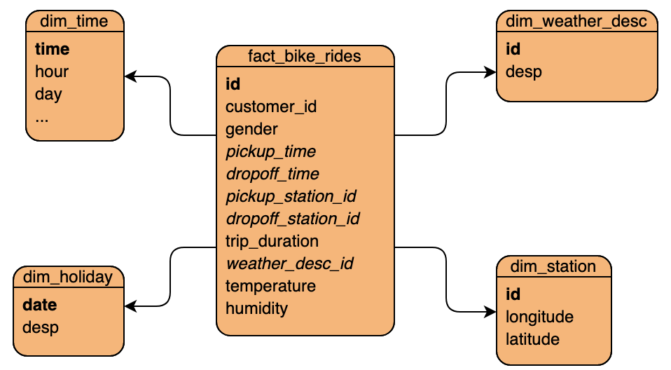

# Redshift Data Warehouse to Enable Insights into Bike-Sharing Economy using Apache Airflow

## Objectives
The project aims to enable analytics on bike rideshares data. Some of the dimensions that could provide insights when combined with this data include _weather_, _time_, _location_ and incidence of _public holidays_. Hence, with this in mind, the project sought to create a data warehouse where data on these dimensions was combined with the rides data.

## Data Sources
The following data sources were used:
|File|Size|Source|Description|
-|-|-|-
`citi_bike_2016.csv`|434.95MB|Kaggle[[1](https://www.kaggle.com/roundedup/new-york-citi-bike-trip-duration)]|The dataset covers 4.5M Citi Bike trips in New York from the first half of 2016. The anonymized dataset contains customer id and gender together with specifics of a bike trip including times (to the second) and station coordinates of pickup and dropoff, and trip duration (in seconds).
`NYC_2016Holidays.json`|535B|Kaggle[[2](https://www.kaggle.com/pceccon/nyc2016holidays)]|It is a list of public holidays that were observed in New York in 2016. Note: the file was converted to `.json` format before usage.
`temperature.json`, `humidity.json`, `weather_description.json`|42.82MB|Kaggle[[3](https://www.kaggle.com/selfishgene/historical-hourly-weather-data)]|It contains hourly data on many weather metrics from 2012 to 2017 for 36 cities, include New York, exceeding 45K datapoints. Only temperature, humidity and description of the weather were used for our purposes. Note: the files were converted to `.json` format before usage.

## Data Model
Given that rides can be modelled as facts, I found that the rest of the datasets can be used to form dimensions. Hence, a STAR schema, presented below, was selected.
<div style="display: flex; justify-content: center;">
    
</div>

The facts table (i.e. `fact_bike_rides`) is sufficiently denormalized and can aid with some analytics on its own. While the dimensions are very easy to join and enable a bigger set of analytics. Some of the questions that can be asked from this data model include:

- What is the average ride length?
- Which areas are the most popular?
- Can the customers be segmented?
- Do weather conditions affect number of rides?
- Is there seasonality in the number of rides?
- How behavior of a rider changes on a public holiday?
- Does rider behavior change by gender?

## Challenges
As seen in the last section, the schema is very simple. But some challenges, particularly around setting up Airflow locally and transforming the datasets, were encountered in achieving the aims of this project. These challenges have been outlined below together with solutions or trade-offs that were made:
1. Disparate data sources required careful design. Since the data was not heavily fragmented among separate files, a high network throughput was achievable by using staging tables and extracting the data in parallel.
2. Weather data was hourly and didn't exactly map to pickup or dropoff times of the bike rides. Hence, a rule of thumb was used: _for each ride, the pickup time was rounded down to the nearest hour and then mapped to the weather data_. The pickup time was used because that is the closest to decision to take a bike ride given weather conditions and, hence, of more interest to a data analyst. On the flip side, this simplification doesn't allow us to easily analyze the effects of a dramatic change in weather mid-ride.
3. Creating the fact table required a series of complex `join`'s. A good schema and data quality checks were used to ensure the correctness of the query.
4. Given the size of the fact and time dimension tables, choosing the right distribution and sort keys was essential for good performance of queries. The rest of the dimension tables were kept purposefully small, so that pickup time could be used as a distribution and sort key. The reason for choosing pickup time is the same as given in (3) above.

## Tools Employed
The following decisions were made with regards to the tooling together with the reasons for the choices:
- A columnar, MPP database was needed to ensure good performance of any analytics queries run on it. Hence, Amazon Redshift was chosen to house the data warehouse. Since it is easier (and faster) to access S3 from Redshift, that is where all the datasets were made available.
- Repeatedly controlling the Redshift cluster using the Web UI is slow and prone to errors. Hence, I wrote [redshift-util](https://github.com/a-jumani/redshift-util) to manage the infrastructure as code.
- Establishing the data warehouse involves staging the data, transforming it and then loading the final tables. All of this must be accompanied by proper data quality checks. Accomplishing this using scripts would be very impractical as debugging and tracking tasks which could be run concurrently would be difficult. Hence, Apache Airflow was used. It already comes with many extensible operators which help with the more nuanced needs of my data pipeline while keeping the code short and maintainable.

## Project Files
The project contain the following files:
```
etl-bike-ridesharing/
+-- airflow/
    +-- dags/
        +-- bike_rides_dag.py               # data pipeline as airflow dag
        +-- bike_rides_variables.json       # to load variables in airflow admin
    +-- plugins/
        +-- operators/
            +-- data_quality.py             # operators to run data quality tests
            +-- load_dimension.py           # operator to load a dimension table from staging tables
            +-- load_fact.py                # operator to load fact table from dimension and staging tables
            +-- stage_redshift.py           # operator to stage s3 data in redshift
        +-- sql/
            +-- sql_queries.py              # queries to create, load and clear staging, dimension and fact tables
            +-- tests.py                    # queries for data quality checks
        +-- custom_plugin.py                # list of the custom operators to allow imports
+-- bike_rides_star_schema.png              # schema from the section above
+-- README.md                               # this file
```

## Process
The following steps were taken to complete the project:
1. Setting up the environment to run Airflow:
    1. MySQL backend was used instead of SQLite.
    2. To enable parallel execution of task, CeleryExecutor with RabbitMQ broker was used initially. I then switched to using a LocalExecutor for easier debugging of issues.
2. Writing SQL queries for:
    1. Creating (and dropping) staging tables.
    2. Testing staging tables post data extraction.
    2. Creating (and dropping) fact table and dimension tables.
    3. Transforming data and loading fact and dimension tables from staging tables.
    4. Testing loaded data in fact and dimension tables.
3. Writing Airflow DAG to execute the data pipeline involing the following:
    1. Creating custom operators, including those for data quality checks, and writing tasks using them.
    2. Designing the DAG flow, choosing between performance (i.e. maximizing parallelism) and maintainability (i.e. isolating groups of related tasks from one another).
4. Launching a Redshift cluster and debugging the DAG. Debugging was done using:
    1. Logs reported by Airflow.
    2. Custom queries run by a separate psycopg2 client. Through this I could check the fixes without running the entire pipeline again. CeleryExecutor allows restarting a failed task but LocalExecutor does not.

## Scalability Considerations
1. If the data were to increase by 100 times, the following things will need to be changed:
    - For the data pipeline itself, I believe the I/O overhead will be the greatest. Hence, raw data will need to be in format which can benefit from parallel extraction. E.g. `.parquet` format files or chunked files.
    - More nodes will be needed in the cluster. While storage capacity is also a constraint, a bigger cluster is required more from the perspective of parallel processing of queries from end-users to enable acceptable processing latencies.
    - Staging table configuration (i.e. choosing the best sort and distribution keys) will need to be experimented with to enable faster transformations.
    - Data quality checks will need to be altered. Since the tables will be much bigger, some queries (e.g. `SELECT COUNT(*) FROM <table>`) will be too inefficient to serve as tests.
2. If the pipeline were run on a daily basis by 7am:
    - The pipeline currently takes 6-7 minutes to execute with a 1-node LocalExecutor to load ~6 months of bike rides. On a daily basis, much less data will need to be appended. Hence, while Airflow can be easily scaled, it won't be needed.
    - The schedule will need to be changed to, e.g., `0 6 * * *` so that it is easily completed before 7am. Note: timezone considerations also need to be dealt with.
    - Must ensure that the Airflow scheduler is alive when it is time to run the DAG and an Airflow worker is available to execute the tasks.
3. If the database needed to be accessed by 100+ people:
    - The first step will be to understand the workload (i.e. the queries, number of concurrent users etc.).
    - Given the workload, the cluster can be scaled up or down as needed. This will be essential to keep processing latencies acceptable.
    - Design of the fact table and dimension tables is tightly coupled with the point just above. Distribution and sort keys must be selected intelligently, keeping in mind how some `join`'s will be impacting the entire system.
    - Loading of the final tables will also need to be tuned (e.g. timing the DAG and tuning the queries) to not disrupt the users and their workloads.
